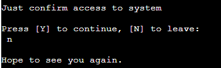

# Project-03-Code-Institute CCTV & SAT TV ordering system

--------------------------------------

## Table of Contents

--------------------------------------

- [Description](#description)
- [Theme](#theme)
- [User Experience](#user-experience)
- [Features](#features)
    - [Future Features](#future-features)
- [Testing](#testing-and-issues-encountered)
- [Technologies](#technologies-used)
- [Deployment](#deployment-to-heroku)
- [Credits](#credits)

----------------------------------------

## Description
----------------------------------------

As I was working in past with similar equipment, I wanted to create an ordering system that allow user to buy it in easy way without any unnecesery details. The live site can be found [here](https://cctv-and-tv-ordering-sys.herokuapp.com/?fbclid=IwAR3jjU2Z52_L418t-HViQGT0uDmrBUHPOKPhCnkGTyKiT4vwA1epErqU6D0).

----------------------------------------

## Theme

----------------------------------------
Despite the project being entirely text-based, I implemented a few little things to make it more appealing to the user. When the user enters the site, he will be greeted with a big heading and the name of ‘SAT & CCTV’. I also added emojis throughout the entire programme when I felt it would be beneficial for various reasons like bad input type etc.

----------------------------------------
## User Experience
----------------------------------------

### User Stories
----------------------------------------
As a first time visitor:

- I want to know which shop I entered and then decide if I want to have a look around or leave the shop 
- I want clear instructions on what I need to enter if I have been asked to do so

As a returning visitor:

- I want to be able to order more 

----------------------------------------

### Python Logic
----------------------------------------

Firstly I imagine the way shop should work like but than I realize that it's much easier with flowchart.
So I created a flowchart with structure of my programme so I would be able to look at it for guidance during the process.

[Back to the Top](#table-of-contents)

----------------------------------------
## Features
----------------------------------------

### Start/first decision

At first program showing information that it's not real shop and all data provided could be fake.

The user is greeted with the LOGO together with a welcome message. Here he can decide if he wishes to continue or leave the shop instead. The option is to enter either Y/N Yes/No. The inputYesNo validating answers throughout the entire programme including user accidentally enters a space before/after the input,leave it blank or use any other key that is not accepted.
  

----------------------------------------
#### Leave Shop 

If the user changes his mind, he can leave the shop by entering N/No/n/no.

----------------------------------------

### Invalid Input

If the user enters a invalid input an error message shows up and he will be asked to enter either Y or N

----------------------------------------
### See Selection/second decision

If the user decides to have a look, a list of products with pricing will be printed and displayed. 

----------------------------------------
#### Ordering/third decision

Now customer deciding and giving number of needed sets. At least 1 set need to be added to order, otherwise will be asked again to provide number.

----------------------------------------
#### Change order/fourth decision

Now after seeing total value and number of ordered sets, customer can change order by typing N/No and go back to add new order or proceed by Y/Yes to next step.

----------------------------------------
### Enter details

The user is now asked to enter their firsname and surname, IE mobile number and address.

----------------------------------------

### Invalid Input - Name/Surname

If the user enters a invalid input he will be asked to start again from the top.

----------------------------------------

### Enter Details - Invalid Number

If the user doesn't enter a valid 10-digit IE number with start 08 or is not a number, a message pops up and informs him that it is incorrect. He can then enter the details again. Until the user enters correct number, the programme keeps looping until a valid number has been entered. 

----------------------------------------
### Enter Details - Address

User is asked for details like house number,street name and city. without checking are they valid or so.

----------------------------------------
### Enter Details - Email

Email has only validation if it's in correct format name@somethig.end

----------------------------------------

### Correct Details

When all data are provided, message about delivery is printed.

---------------------------------------

## Confirmed Details & Google Sheet

Once the user has provide his details, they are simultaneously added to the Google Sheet.

[Back to the Top](#table-of-contents)

## Future Features
----------------------------------------

- Adding more options to buy.
- Automate displaying avaible stock if spreadsheet will receive new products
- Spread customer details for seperate cells

Add more validation for phone numbers, email and address. Use less hardcoded values so I'll be able to add products in spreadsheet and display them automaticly without adding more code.

----------------------------------------
## Technologies Used 
----------------------------------------

- Python, to write my code
- Heroku, to deploy my site

----------------------------------------

## Python Libraries/Modules
----------------------------------------

- Time - to add the .sleep() function and delay my code in the terminal
- [Datetime](https://www.programiz.com/python-programming/datetime/strftime) - to print the current date and time on the receipt
- [Sys](https://www.hashbangcode.com/article/stopping-code-execution-python) - to exit the programme
- [Pyfiglet](https://www.geeksforgeeks.org/python-ascii-art-using-pyfiglet-module/) - to create a header
- Emoji - to add some graphical content
- Pyinputplus - to validate some inputs  
- Gspread - as API for my Google Sheet

--------------------------------------
## Testing And Issues Encountered
--------------------------------------

The site has been tested by me thoroughly during its creation to ensure that the programme runs as it should and errors are being caught. Friends also tested it on a variation of laptops and with different browsers without any issues.

I had a lot of fun creating this shop. I did, however, run into a few issues:

1) At first I found that not all kind of data can be passed to append_row method and I was checking all returned values from functions 1 by 1 before I was able to send them in 1 line to Google file.

2) Returning tuples in some cases from functions which I find when next function couldn't modifiy them. So I stated checking types of returned values and make sure to modify data which I was expecting (Lists,Stings)

[Back to the Top](#table-of-contents)

## Unfixed Bugs

At the moment, street and city not accepting white spaces.

### Validators Testing
--------------------------------------

The code has been tested by running it through the PeP8. All of the errors that have been encountered were due to trailing whitespaces or either too many or not enough blank lines.

No errors were found during the final check.

--------------------------------------

### Browser Testing
--------------------------------------

The programme has been tested on Google Chrome, Firefox. Due to the nature of the programme, it is not suitable for mobile phones and smaller devices.

--------------------------------------
### Deployment to Heroku
--------------------------------------

The website was deployed by following the steps below: 

1. Log in [Heroku](https://id.heroku.com/login). 

2. Click 'New' and select 'Create new app'

3. Choose a name for the app, region and click on 'Create app'

4. Only 'Deploy' and 'Settings' are relevant from the menu section. Starting with the 'Settings' first.

5. Now Buildpacks need to be added. They install future dependencies that are needed outside of the requirements file. The first is Python and the second is node.js. Python needs to be selected first and then node.js. Save this selection.

6. Now the 'Deploy' section needs to be selected from the menu and connect it to github.

7. Enter the name of the repository we want to connect it with and click 'Connect'

8. The choice appears now to either deploy using automatic deploys or manual deployment, which deploys the current state of the branch.

9. Click deploy branch. 
    

## Credits 
--------------------------------------

- [Stackoverflow](https://stackoverflow.com) - to clarify some possibilities
- [MakeUseOf](https://www.makeuseof.com/how-to-include-emojis-in-your-python-code/) - for the syntax to add emojis
- [GeeksForGeeks](https://www.geeksforgeeks.org/python-ascii-art-using-pyfiglet-module/) - help on which module to import and how to create my header
- [W3 School](https://www.w3schools.com/howto/howto_css_fixed_footer.asp)
- Love Sandwiches - for general guidance and how to set up my API

The text for this programme has been written by myself.

--------------------------------------
## Acknowledgments
--------------------------------------

My thanks goes to the Code Institute.

A special thanks also to my amazing Mentor Andre who helped me coming up with this idea.

[Back to the Top](#table-of-contents)
